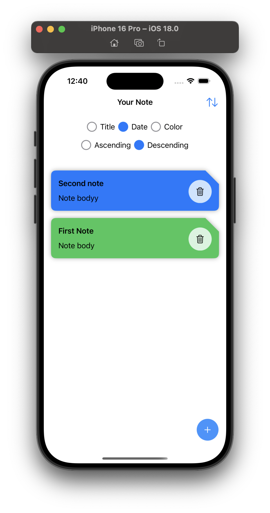
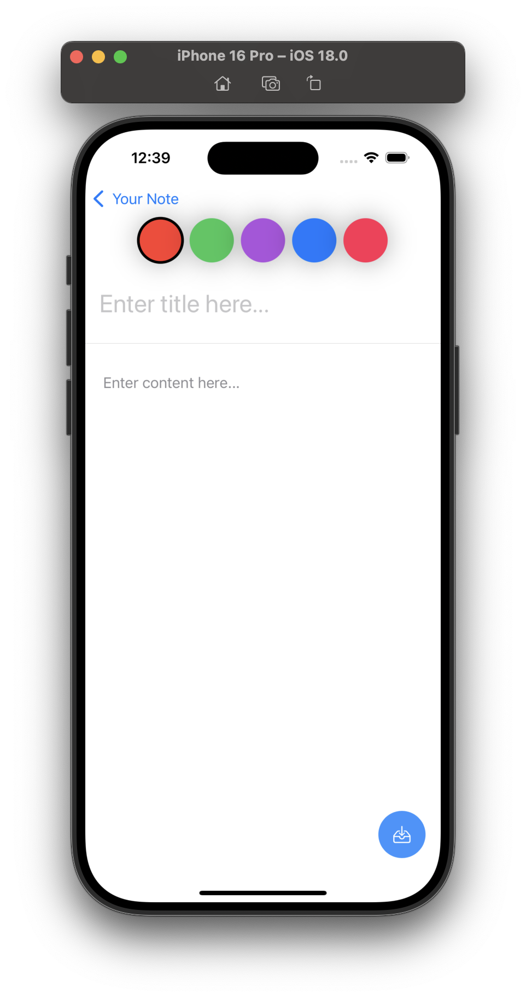

# NoteApp.ios

A simple note-taking app built for iOS using Swift and SwiftUI. The app allows users to create, edit, delete, and store notes locally.

## Features

- Create new notes
- Edit existing notes
- Delete notes
- Local data storage using CoreData
- Simple and intuitive user interface

## Technologies Used

- **Swift**: For iOS development
- **SwiftUI**: For building the UI
- **CoreData**: For local data persistence
- **Xcode**: Development environment

## Screenshots

| Home Screen                        | Create/Edit Note                     |
|------------------------------------|--------------------------------------|
|  |  |

## Contributing

Contributions are welcome! If you'd like to improve this app or fix any bugs, feel free to fork the repository and submit a pull request.

## License

This project is licensed under the MIT License - see the [LICENSE](LICENSE) file for details.

